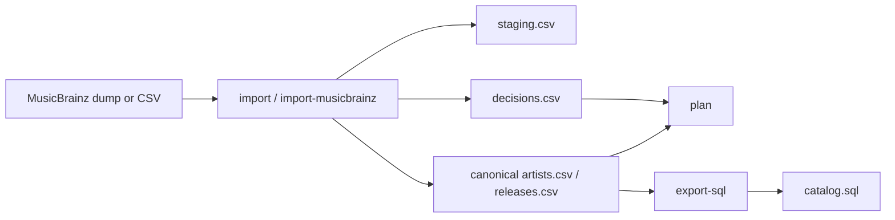

# Architecture

## Flow



## Storage Layout

```text
.catalog-data/
  canonical/
    artists.csv
    releases.csv
  runs/
    run_YYYYMMDD_HHMMSS/
      input copy
      staging.csv
      decisions.csv
      report.txt
```

## Matching Rules

Import decisions are applied in this order:

1. Missing required fields -> `FAILURE`
2. Exact UPC match -> `AUTO_MATCH`
3. Exact `artist|title|date` key match -> `AUTO_MATCH`
4. Same artist and title but different date -> `REVIEW`
5. Otherwise create canonical artist/release -> `AUTO_CREATE`

## Why This Shape

- Canonical data survives across runs.
- Per-run decisions stay auditable.
- SQL export is separated from ingestion.
- The target schema is configurable without requiring ORM integration.
